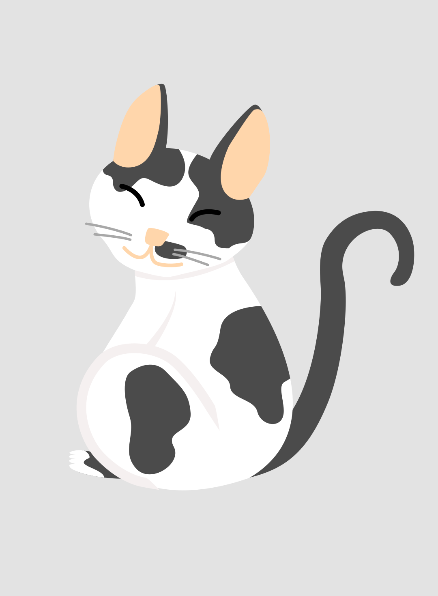



Hello there! If you are here and don't know me, I'm **_José Augusto dos Santos Goulart_** (or just **Augusto**) a computer science undergraduate with a great passion for linguistics, design, history, politics, and you guessed it, computers. This page is just an aggregation of links to some of my projects/works and shit posting.

***

## About me

I had my introduction to coding through video games mods, after that I pick up on C, C++, and Assembly with mixed results (you can guess which one I preferred). After some time I was introduced to more high-level programming languages (thanks to one of my CS professors) such as Python, Lua, Go, and Ruby. Still, I prefer to code with C or C++, call me a boomer if you want.

Here, have a drawing of my cat **_Lily_** I made when I started learning how to use vector graphics:


