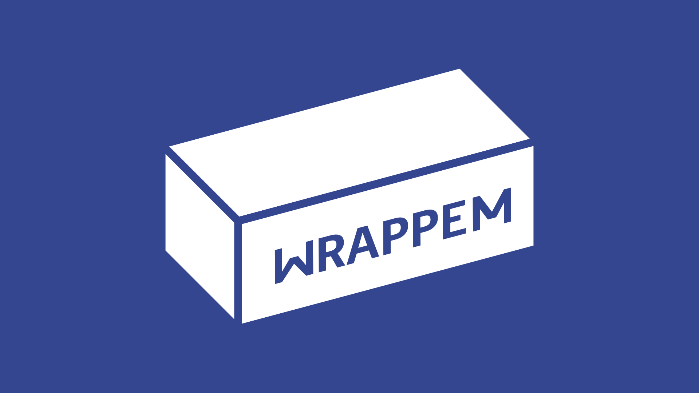
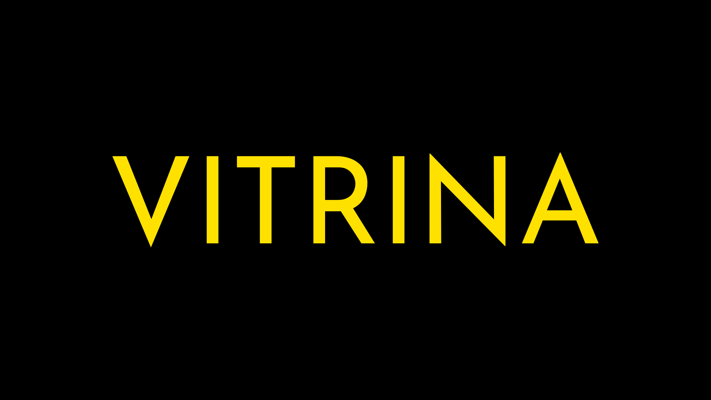
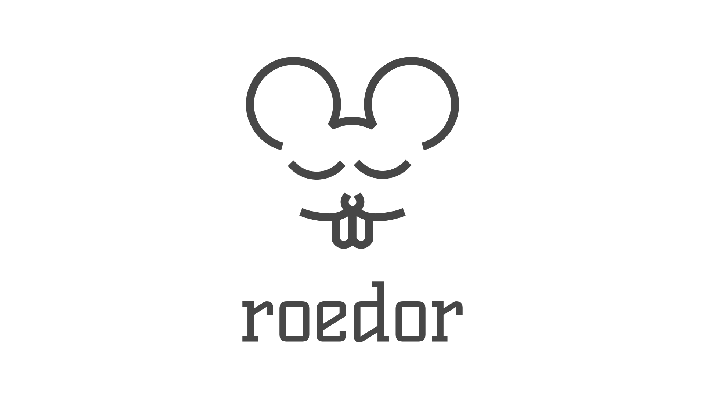
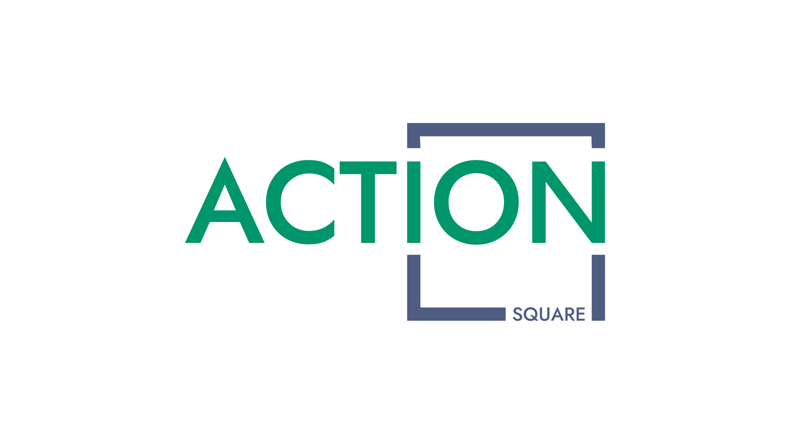
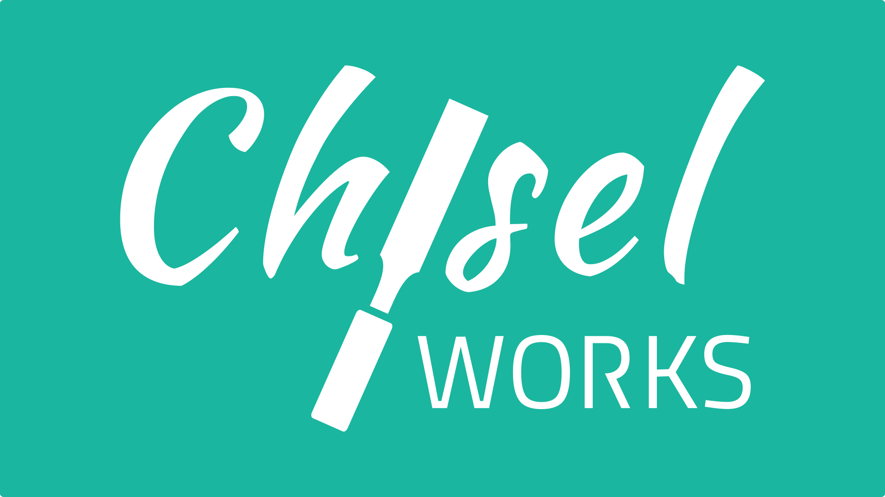
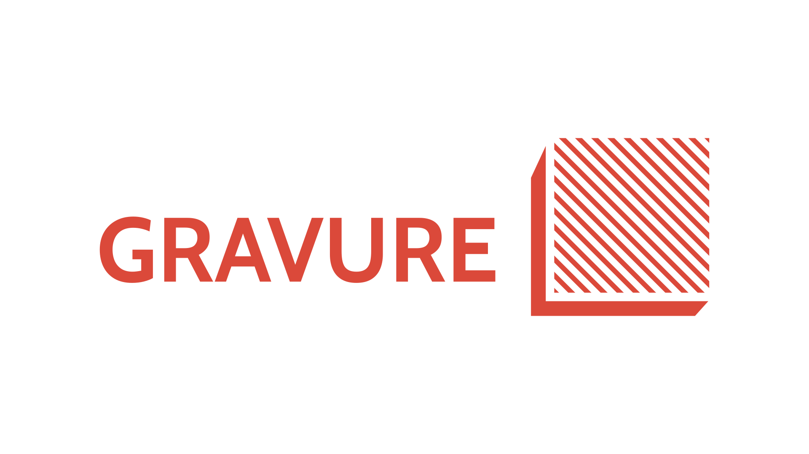
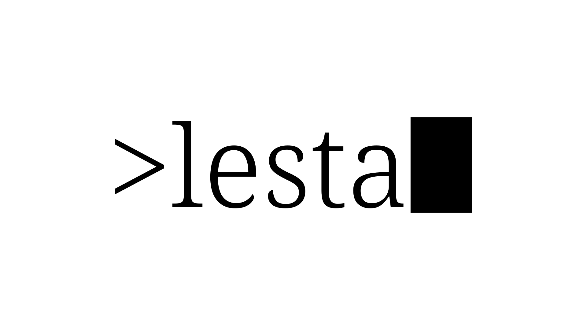
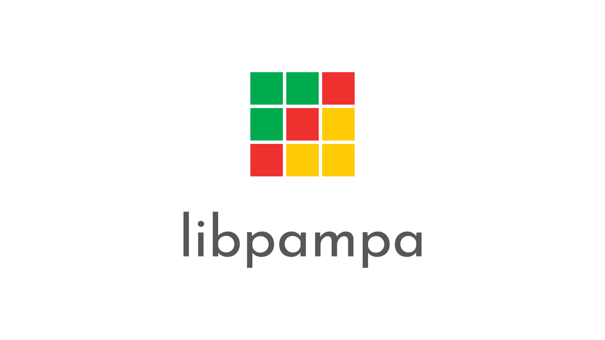
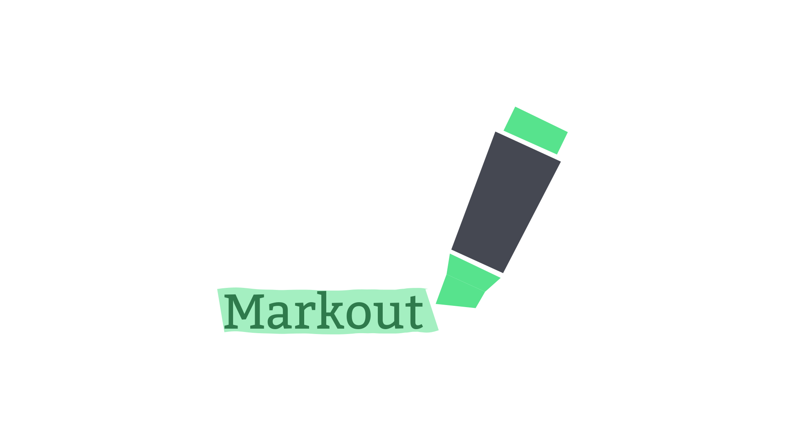
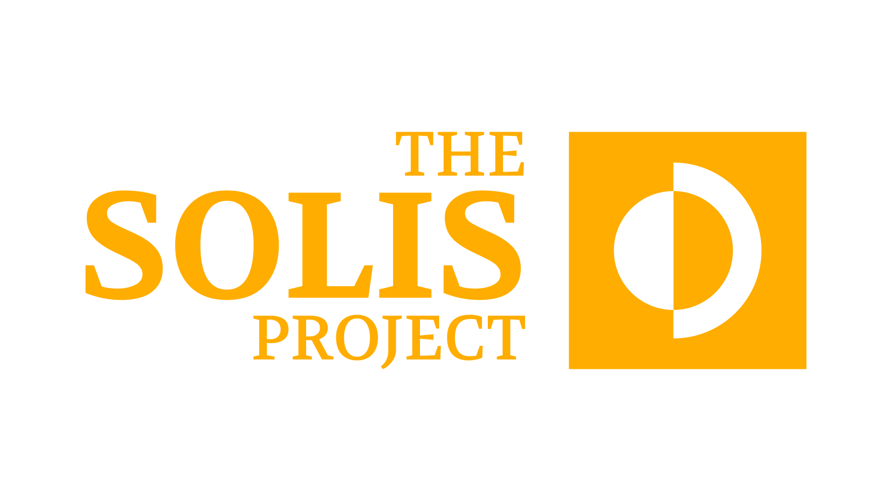



Here are some of the projects I have made so far, some of them are still a work-in-progress, so they might not have links attached to them.

***

  

    
    

      <a target="_blank" href="https://github.com/oAGoulart/wrappem">WrappEm</a>
    

  

  

    
    

      <a target="_blank" href="https://github.com/oAGoulart/scriptwrapper">Script Wrapper</a>
    

  

  

    
    

      <a target="_blank" href="https://github.com/oAGoulart/vitrina">Vitrina</a>
    

  

  

    
    

      <a target="_blank" href="https://github.com/oAGoulart/roedor">Roedor</a>
    

  

  

    
    

      <a target="_blank" href="https://github.com/action-square">Action Square</a>
    

  

  

    
    

      <a target="_blank" href="https://github.com/chiselworks">Chisel Works</a>
    

  

  

    
    

      <a target="_blank" href="https://github.com/oAGoulart/commune">Commune</a>
    

  

  

    
    

      <a target="_blank" disabled>COS</a>
    

  

  

    
    

      <a target="_blank" disabled>Gravure</a>
    

  

  

    
    

      <a target="_blank" href="https://github.com/oAGoulart/lesta">lesta</a>
    

  

  

    
    

      <a target="_blank" href="https://github.com/oAGoulart/libpampa">libpampa</a>
    

  

  

    
    

      <a target="_blank" href="https://github.com/oAGoulart/markout">Markout</a>
    

  

  

    
    

      <a target="_blank" disabled>The Solis Project</a>
    

  


